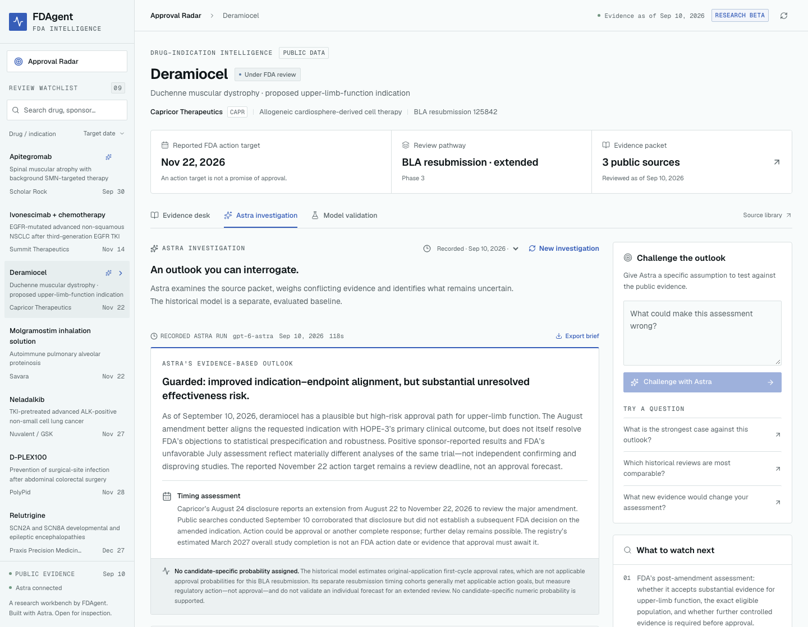

# FDAgent Approval Radar

**Investigate what could change an FDA drug-review outcome, using public evidence and GPT-6 Astra.**

Approval Radar follows **33 real drug–indication review episodes across 29 companies**, with **98 curated primary sources** and recorded public-database scans for every candidate. It connects sponsor disclosures, trial protocols and results, FDA reviews and letters, approved applications, labeling and research publications. Astra investigates which evidence changes the case and turns that assessment into specific diligence questions. No customer uploads are required.

Built for the GPT-6 Astra hackathon in New York. This is an original, standalone public project; the private FDAgent application and its data are not included.



## Try it

- [Public interactive demo](https://kllymx.github.io/fdagent-approval-radar/) — genuine recorded Astra investigations, clearly labeled; no API key required.
- [Four-minute demo script](docs/demo-script.md)
- [Evidence evaluation](docs/evidence-evaluation.md) and [independent agent review of the recorded runs](data/recorded-run-review.md)
- [Expanded investigation review](data/deep-review-2026-09-10.md) and [additional review queue](data/deep-review-expanded-2026-09-10.md)
- [Published research coverage by drug and evidence domain](docs/research-coverage.md)
- [Product thesis and customer experiment](docs/product-thesis.md)

The public demo is a September 10, 2026 evidence snapshot. Its dates and status are not automatically refreshed. Live local investigations can retrieve newer evidence and must distinguish that from the snapshot.

Company logos come from Firecrawl's branding extraction of official sponsor sites. The app serves the verified assets locally; [brand provenance and refresh instructions](public/brands/README.md) explain their sources and ownership.

## What Astra actually does

1. Builds a source map from ClinicalTrials.gov, Drugs@FDA, drug labeling and PubMed. The catalog and recorded scans link to **220 unique public URLs**; bounded discovery matches are clearly separated from confirmed indication-specific evidence.
2. Chooses tools to inspect trial results, read FDA documents, search within long reports, retrieve complete-response letters and discover newer disclosures through Firecrawl.
3. Can query an existing FDAgent MCP installation for inspections, warning letters, exact facilities, Orange Book and Purple Book references. A company-name match is a lead; the model must verify product/facility identity and original evidence.
4. Produces a **decision brief**: the pivotal question, strongest case for approval and setback, evidence that would decide between them, conditional paths and concrete questions for a licensing or investment meeting.
5. Accepts challenges against a previous report, compares the earlier and current claims and explains whether its outlook changed. The brief and comparison export to Markdown.

The first screen opens with three concrete research questions linked to exact recorded Astra investigations. Users inspect the evidence and actual tool executions, then challenge a conclusion locally. The candidate list is a supporting navigation surface.

Candidate pages lead with **Astra's approval outlook**, its key diligence question and one action to explore the underlying reasoning. The reported FDA action target is secondary. Four compact, source-linked factors cover clinical, safety, manufacturing and regulatory evidence. These qualitative categories are real Astra interpretations, not a weighted score or calibrated approval probability. Initial assessments remain visibly distinct from full investigations; completed episodes show the observed FDA outcome. See the [assessment rubric and review limits](docs/outlook-methodology.md).

The interface retains FDAgent's restrained visual conventions, with compact company logos, sentence-case labels, a searchable/filterable candidate overview and an evidence map. Generic sparkle icons are removed. The evidence map distinguishes retrieved records, empty searches, failures and sources not checked.

Nine drug-specific trial charts across six candidates show reported efficacy and safety results, with populations, endpoints, sample sizes and confidence levels preserved. Clinical results, review timelines and supporting signals open on demand; a selector shows one clinical comparison at a time. Chart values are source-reviewed measurements, separate from Astra's qualitative judgments. [Clinical chart sources and interpretation limits](data/trial-visuals-review.md) are public.

The interface shows actual tool progress. Recorded reports preserve their model ID, question, tool trace, token use and measured duration. Source-ID validation checks that references exist; it does **not** establish that every claim is scientifically correct. Discovery metadata is explicitly labeled and never presented as a full-document review.

Reviewed Astra investigations demonstrate different kinds of reasoning:

- **Satralizumab:** Astra inspected two pivotal trial result records and a newly published paper. It connected one failed primary endpoint to stopped confirmatory secondary testing, compared responder rates with continuous proptosis and diplopia results, and separated an existing NMOSD approval from the proposed thyroid-eye-disease indication. The decision brief asks for the analyses and FDA feedback that would resolve the replication question.
- **Apitegromab:** An earlier challenge found an August 21 update confirming completed removal of Catalent and revised the initial assessment. A further challenge used FDAgent's inspection dataset, correctly distinguished BIMO clinical-research oversight from manufacturing assessment, and kept the outlook unchanged. Both revision and resistance to a misleading premise are visible.
- **Zanzalintinib:** Astra compared the original trial-design paper with the later dual-primary description and identified the amended testing plan as an unresolved diligence question. It preserved the distinction between an unverified amendment and proof that the positive overall-survival result is invalid.
- **Lorundrostat:** Astra read published hypertension trials, checked dose-specific blood-pressure and electrolyte/renal safety results, and kept a failed sleep-apnea endpoint separate from the hypertension application. The resulting assessment is mixed: supportive efficacy with material safety questions. An earlier thin-packet favorable label was withheld after review, not silently edited.
- **Deramiocel:** Astra reconciled FDA and sponsor endpoint analyses, preserved the distinction between post-completion and post-unblinding changes, and found a later cardiac-analysis correction. It assessed the indication amendment without treating a prior FDA briefing as the final decision.

These are selected, source-reviewed executions, not proof of comparative model superiority or future decision accuracy. [Review notes and execution limits](data/recorded-run-review.md) are public.

In five additional original-document exercises, a separate project agent marked **19 of 20 predefined distinctions met and one partially met**. The questions, unchanged answers, exact grading pointers and retry disclosure are public. This small, selected and agent-graded exercise has no comparison model and is not an approval-accuracy benchmark.

## Forecasting, with measurable limits

A PDUFA target is an **FDA action target**, not a promised approval date. This project does not invent an individual probability or an exact future approval date.

The public-data model is reproducible and evaluated separately from Astra:

| Question                                                     | Evidence and result                                                                                                                                                                             |
| ------------------------------------------------------------ | ----------------------------------------------------------------------------------------------------------------------------------------------------------------------------------------------- |
| Can review class forecast annual first-cycle approval rates? | Frozen historical class means: **6.9 percentage-point MAE** on **six held-out annual cohort rates**, versus **11.6 pp** for a pooled baseline. This is not individual drug accuracy.            |
| Can historical counts predict action by the applicable goal? | **603 held-out due/resolved action outcomes**. Class Brier score **0.0390**, pooled **0.0383**: the pooled baseline performed slightly better. An on-time action can be a CRL.                  |
| What about unfinished reviews?                               | Eight held-out actions still within goal remain unresolved and are excluded from binary scoring.                                                                                                |
| What does a CRL do to a timeline?                            | Twelve selected, real FDA review histories show review cycles and sponsor-response intervals. All were eventually approved in the selected appendix; they cannot estimate approval probability. |

Read [model methodology, source vintages and reproduction commands](model/README.md). Individual probabilities remain `null`. A future drug-level model needs a complete application-cycle cohort, timestamped feature snapshots, reliable unsuccessful/pending outcomes and prospective calibration. An approvals-only database or the selectively disclosed CRL archive cannot provide that on its own.

## Run locally

Requirements: a supported Node.js release (22.22.2+, 24.15+, or 26+), pnpm 11, Python 3.9+ for data/model checks, and `pdftotext` for live PDF reading (`brew install poppler` on macOS; `apt install poppler-utils` on Debian/Ubuntu).

```bash
pnpm install
cp .env.example .env.local
# Set ASTRA_API_KEY in .env.local. Add FIRECRAWL_API_KEY for live web discovery.
pnpm preflight
pnpm dev
```

Open `http://127.0.0.1:5178`. The API runs on port 8788. Without credentials, the catalog, evaluated model and recorded runs remain available. Live research requires Astra access; there is no silent model fallback.

`ASTRA_BASE_URL` can point to an event-provided OpenAI-compatible Responses endpoint. Keep keys server-side. The API uses `gpt-6-astra`, structured output, function calls and configurable reasoning effort. Firecrawl is optional; without it, public FDA/trial APIs and curated sources remain available, while web-search failures are reported.

To reuse an existing FDAgent installation, set `FDAGENT_MCP_ENTRY` to its already-built MCP server entry point and, if needed, `FDAGENT_ENV_FILE` to its existing environment file. The bridge forwards only the three allowlisted backend settings needed by that process; private code and configuration remain outside this repository. It exposes read-only, bounded reference queries. Public demo snapshots omit the FDAgent compliance dataset.

Generate or refresh initial evidence assessments with real Astra (unchanged input packets are reused):

```bash
pnpm assess
# Or select one candidate:
pnpm assess apitegromab-sma
```

To investigate the unresearched catalog with real tool use:

```bash
pnpm investigate:catalog
# Or select explicit candidate IDs:
pnpm investigate:catalog bepirovirsen-hbv
```

The bounded batch resumes completed work, records failures and stores unpublished outputs locally. Review original sources before selecting runs for publication with `scripts/record.ts`.

The assessment-only command interprets existing source summaries and reviewed investigations. It does not run web retrieval. For deeper research, use Investigate with Astra in the local app. Newly completed reports update the visual assessment from the same research.

Collect fresh public evidence independently of a paid model run:

```bash
pnpm evidence satralizumab-ted
pnpm evidence --refresh satralizumab-ted
# After reviewing coverage and provenance, explicitly publish its snapshot:
pnpm evidence --record satralizumab-ted
```

```bash
pnpm test
pnpm data:validate
python3 -m unittest discover -s scripts/data -p 'test_*.py'
python3 model/rebuild.py --check
python3 -m unittest discover -s model -p 'test_*.py'
pnpm build
pnpm start
```

For a static public demo containing only explicitly recorded runs:

```bash
VITE_BASE_PATH=/fdagent-approval-radar/ pnpm build:demo
```

Serve `dist/` at that base path. Set `VITE_BASE_PATH=/` for root hosting. No credentials or paid backend are bundled.

## Data and evaluation

- [Catalog](data/catalog.json): 33 review episodes, 98 curated primary source records, milestones, scoped signals and retrieval dates. One already-approved episode remains visible with its corrected status.
- [Evidence snapshots](data/evidence): 33 scans covering four public database families, with 162 returned record occurrences across 157 unique URLs. Some records occur in multiple candidates; hits are not automatically evidence for the requested indication.
- [Connector scope and provenance](docs/evidence-sources.md): exact application/NCT lookup, authority limits, metadata-only records and API failures.
- [Source audit](data/source-audit.md) and [refresh tools](scripts/data/README.md): reproducible transport/hash checks, including failures. Fetch success does not certify scientific accuracy.
- [Model](model/): eight FDA annual reports, aggregate observations, source hashes, exact computation and tests.
- [Five authored reasoning challenges](data/evaluation-cases.json): original-document questions and a transparent rubric. These are a small case study, not a representative benchmark or forecast validation.

To fetch the evaluation documents and run the document-only harness:

```bash
python3 scripts/data/refresh_sources.py --firecrawl
pnpm evaluate
```

The optional `--firecrawl` flag requires an installed, authenticated Firecrawl CLI; omit it for direct public retrieval only. Blocked sources must be retrieved before evaluating. The harness withholds candidate summaries, curated signals and expected answers from Astra. Outputs and source hashes are saved under ignored `.runtime/evaluation/`; grading is a separate review. Existing completed outputs are reused; remove that local directory deliberately for a fresh full run. API calls incur provider charges.

## Architecture and deployment

React/Vite interface → Node HTTP API → Astra Responses tool loop → public FDA/ClinicalTrials.gov/NCBI APIs, Firecrawl and an optional existing FDAgent MCP process. Historical computation is dependency-free Python; the interface reads its checked-in artifact.

The default server binds to loopback. A public live server requires `RADAR_ACCESS_TOKEN`; authenticated clients send it as a bearer token. Public reads expose the curated catalog and deliberately recorded runs. Unpublished runtime runs require authorization when a token is configured. The browser demo intentionally has no public paid-research endpoint. Live requests are limited to two concurrent runs, a bounded tool budget and an eight-minute request deadline. Cancellation propagates to public requests, Firecrawl and FDAgent subprocesses. Incomplete model responses are saved locally for inspection and never promoted to completed reports.

Raw source caches, local questions/runs and `.env` files are ignored. Publishing an investigation is an explicit step using `scripts/record.ts` after review; it strips source bodies and copied search snippets while preserving model findings. Retrieved documents are untrusted evidence and never authorize actions or access to secrets.

## License

Original code is [MIT licensed](LICENSE). FDA, registry and sponsor materials retain their own terms. Linked third-party publications and press releases are not relicensed or redistributed in full. Public source metadata, short attributed summaries and original model outputs are included for inspection.
